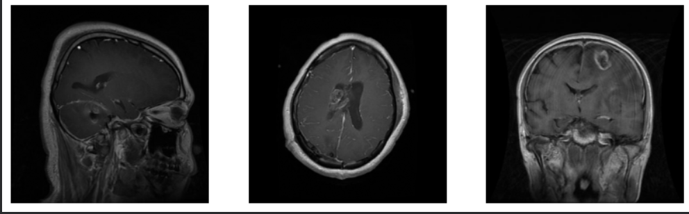
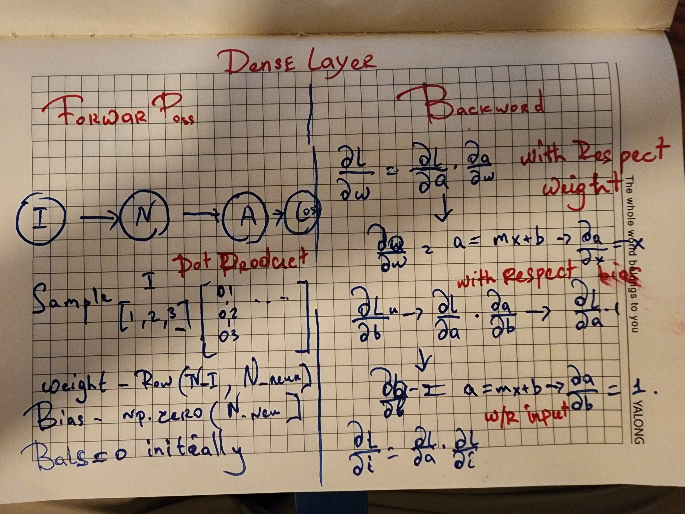
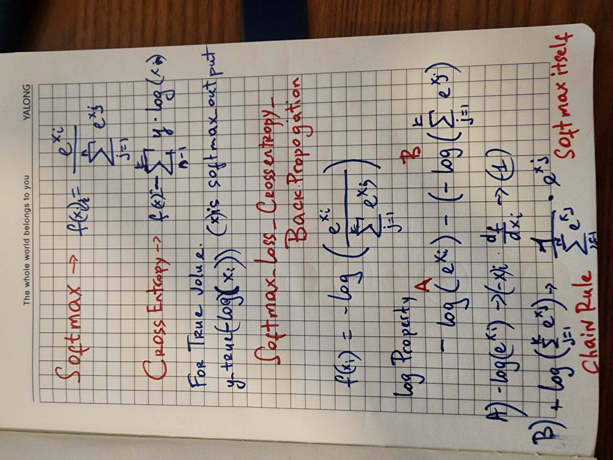

# Deep-Learning-From-Scratch-MRI-Scan-Analysis
Research-oriented implementation of neural networks from first principles, demonstrating mathematical foundations and medical image classification.

## About Data

#Brain Tumor MRI Dataset

classes 

              Training/
    glioma/        (1400 images)
    meningioma/    (1400 images)
    pituitary/     (1400 images)
    notumor/       (1400 images)

              Testing/
    glioma/        (400 images)
    meningioma/    (400 images)
    pituitary/     (400 images)
    notumor/       (400 images)

                
## Structure

## Dense Layer

Implements a fully connected (dense) layer using matrix multiplication:

Z = XW + b

The forward pass computes the affine transformation, while the backward pass derives gradients with respect to the weights, biases, and inputs using the multivariable chain rule:

Backward:

dL/dW = Xᵀδ

dL/db = Σδ

dL/dX = δWᵀ

Weights are initialized with **He initialization** np.sqrt(2 / n_input) for stable training with ReLU activations.

## CATEGORICAL CROSS ENTROPY

if ndim == 2 --> one hot encoded 

SAMPLE 

one_hot_encoded = np.array(

               [[1,0,0],

               [0,1,0],
               
               [1,0,0],
               
               [0,0,1]])

               
input = np.array(

                 [[ 0., 0., 0.],

                 [-0.00994372, -0.00501981, -0.00084307],
                 
                 [ 0.01182119, -0.00391712, -0.00248948],
                 
                 [-0.00968822, -0.01280488, -0.00361701]]) 
                 

np.sum( 0one_hot_encoded * input , axis = 1 , keepdims = 1)

output = np.array(

                  [[ 0.],

                  [-0.00501981],
                  
                  [ 0.01182119],
                  
                  [-0.00361701]])
                  
/////////

elif ndim == 1 list format

l_encode_target = np.array(

                 [0,1,0,2]  )    

input[ range ( len( l_encode_target) ), l_encode_target ].reshape(-1,1) # reshape part broudcasting 

output = np.array(

                  [[ 0.],
                 
                  [-0.00501981],
                 
                  [ 0.01182119],
                
                  [-0.00361701]])

self.output = -np.log(output)   # -log and use np.clip prevent overflow          

               
## Softmax_loss_Categoricalcrossentropy backpropogation 

Computing the Softmax and Cross-Entropy derivatives separately requires differentiating the Softmax function, which produces a full **Jacobian matrix**. Applying the chain rule through this Jacobian is computationally unnecessary.

By combining the two operations, many terms cancel during differentiation—particularly the logarithm from the Cross-Entropy loss and the exponential terms from Softmax. The gradient simplifies to a compact expression:

    dL/dz = (softmax(z) - y) / N

    soft_output[range(sample),self.y_true] -= 1 
    
    dl_dz = soft_output / sample

where:

* (z) are the logits (inputs to Softmax),
* (y) is the one-hot encoded ground truth,
* (N) is the batch size when the mean loss is used.

This avoids explicitly constructing the Softmax Jacobian, reduces computation, and is the standard implementation used in modern deep learning frameworks.
