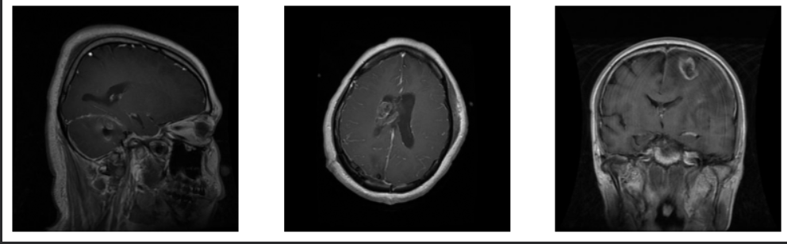
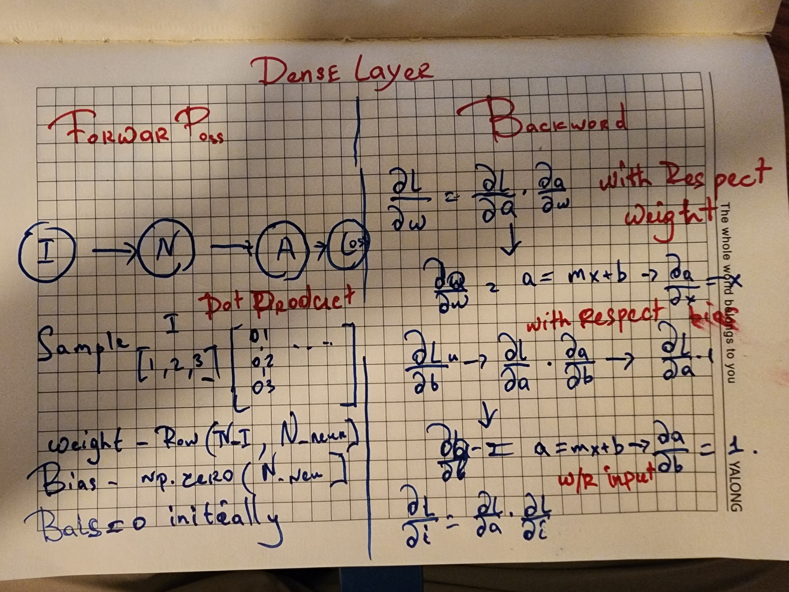
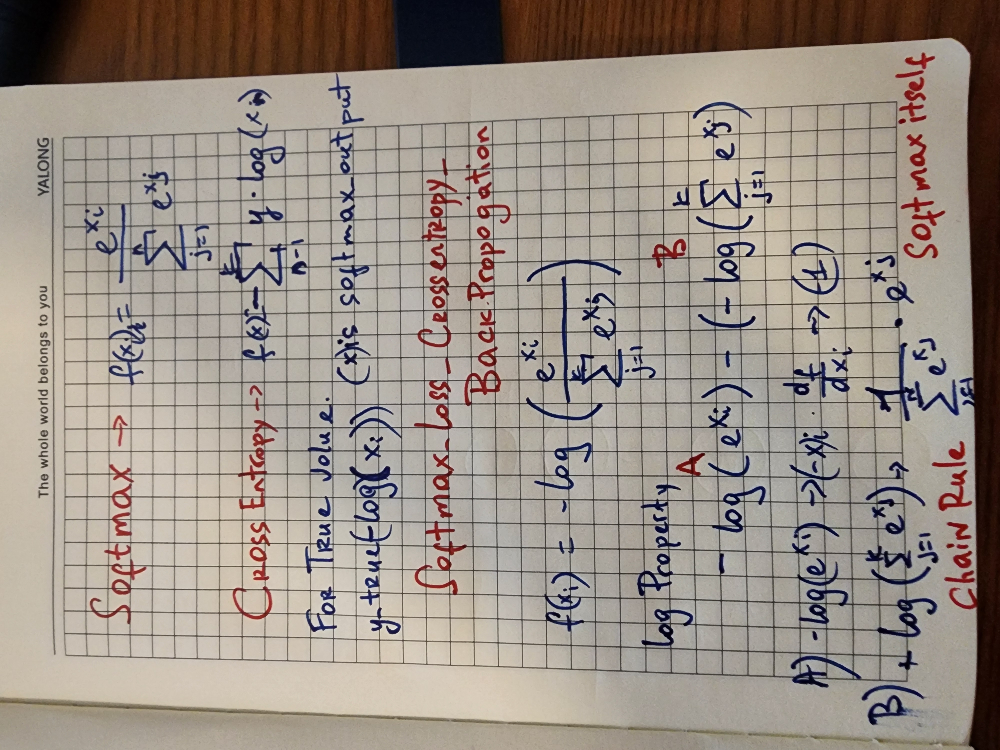

# Deep-Learning-From-Scratch-MRI-Scan-Analysis
Research-oriented implementation of neural networks from first principles, demonstrating mathematical foundations and medical image classification.

## About Data

## Brain Tumor MRI Dataset

classes 

              Training/
    glioma/        (1400 images)
    meningioma/    (1400 images)
    pituitary/     (1400 images)
    notumor/       (1400 images)

              Testing/
    glioma/        (400 images)
    meningioma/    (400 images)
    pituitary/     (400 images)
    notumor/       (400 images)

                
## Structure

## Dense Layer

Implements a fully connected (dense) layer using matrix multiplication:

Z = XW + b

The forward pass computes the affine transformation, while the backward pass derives gradients with respect to the weights, biases, and inputs using the multivariable chain rule:

Backward:

dL/dW = Xᵀδ

dL/db = Σδ

dL/dX = δWᵀ

Weights are initialized with **He initialization** np.sqrt(2 / n_input) for stable training with ReLU activations.

# CNN Convolutional Neural Network 

## MAIN QUESTION WHY WE NEED IT AT ALL 
so when we use dense layer every pixel starts with different random weights, so even similar pixels are initially treated differently

             np.random.randn(x,y)
             
 so what if it starts radnomy issue is next step is relu and we might loose correlation -- Every location gets its own opinion 
 Image is something differnt for example a man in red shirt that mean his cloth color has same or similar color sharing 
 and with cnn we can make assumtion more easier way -- cnn says I'll use one opinion everywhere unless the data tells me otherwise
 We are making an overall assumption about the image with a few number of weights
 Also another reson object movement cnn can deal with if efficeintly For example, if an eye moves two pixels to the left, it's still an eye

Output size

                outputsize = (inputsize - kernelsize) + 1          
### Sample 

       input =   np.array(array([[[4, 2, 8, 2],
                                  [6, 9, 9, 9],
                                  [8, 8, 9, 4],
                                  [7, 3, 3, 9]]]),
         
        kernel = np.array([[[9, 5],
                            [2, 3]]]))
        patch_1 = [4,4, 
                   6,9]

        first_patch_calc = (9 * 4) + (5 * 2) + (6 * 2) + (9 * 3)
       
        
### Result forward 

        self.output = np.array([[[[ 1.10188775, -6.8881995 ,  9.80237992],
                                  [-0.67406507,  3.77661011,  8.35969156],
                                  [ 7.31238385,  4.02239299,  6.10366617]]]])

                                  
so when we do difrentiation with respect to weight that means
in forward pass we deal with single patch y = w1*i11 + w2*i12 + w3*i13 + w4*iw14
from partial derivative rule if we diffrentiate w1 with respect to y   we assume
other stuff as constant f(x) = c --> f'(x) = 0 in diffretiation patch will left with
single weight that we are diffrentiating with respect to

so we add all patch outputs literally means df/dw1 from all patch
reson is in optimisation we will save all contributution of weights
and optimise w1

## CATEGORICAL CROSS ENTROPY

if ndim == 2 --> one hot encoded 

SAMPLE 

one_hot_encoded = np.array(

               [[1,0,0],

               [0,1,0],
               
               [1,0,0],
               
               [0,0,1]])

               
input = np.array(

                 [[ 0., 0., 0.],

                 [-0.00994372, -0.00501981, -0.00084307],
                 
                 [ 0.01182119, -0.00391712, -0.00248948],
                 
                 [-0.00968822, -0.01280488, -0.00361701]]) 
                 

np.sum( 0one_hot_encoded * input , axis = 1 , keepdims = 1)

output = np.array(

                  [[ 0.],

                  [-0.00501981],
                  
                  [ 0.01182119],
                  
                  [-0.00361701]])
                  
/////////

elif ndim == 1 list format

l_encode_target = np.array(

                 [0,1,0,2]  )    

input[ range ( len( l_encode_target) ), l_encode_target ].reshape(-1,1) # reshape part broudcasting 

output = np.array(

                  [[ 0.],
                 
                  [-0.00501981],
                 
                  [ 0.01182119],
                
                  [-0.00361701]])

self.output = -np.log(output)   # -log and use np.clip prevent overflow          

               
## Softmax_loss_Categoricalcrossentropy backpropogation 

Computing the Softmax and Cross-Entropy derivatives separately requires differentiating the Softmax function, which produces a full **Jacobian matrix**. Applying the chain rule through this Jacobian is computationally unnecessary.

By combining the two operations, many terms cancel during differentiation—particularly the logarithm from the Cross-Entropy loss and the exponential terms from Softmax. The gradient simplifies to a compact expression:

    dL/dz = (softmax(z) - y) / N

    soft_output[range(sample),self.y_true] -= 1 
    
    dl_dz = soft_output / sample

where:

* (z) are the logits (inputs to Softmax),
* (y) is the one-hot encoded ground truth,
* (N) is the batch size when the mean loss is used.

This avoids explicitly constructing the Softmax Jacobian, reduces computation, and is the standard implementation used in modern deep learning frameworks.
